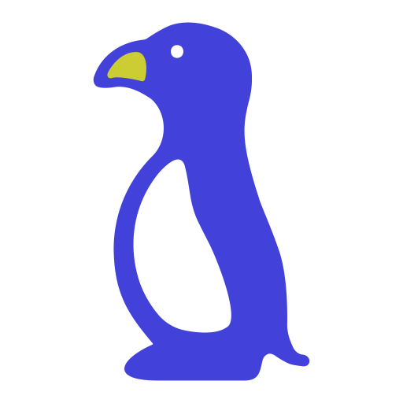
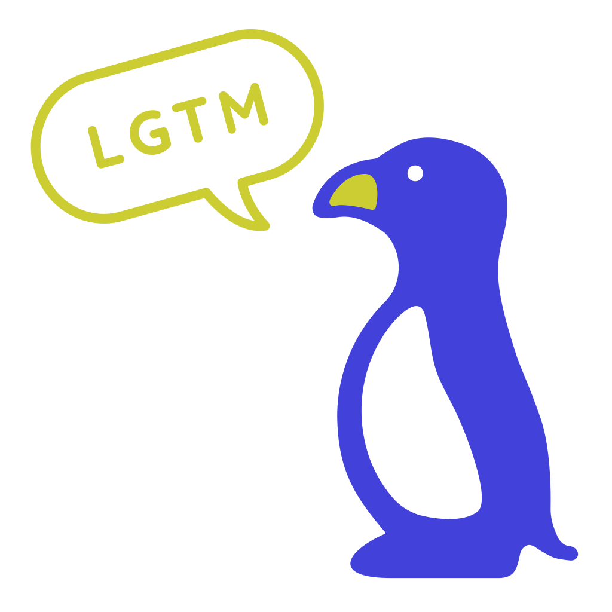
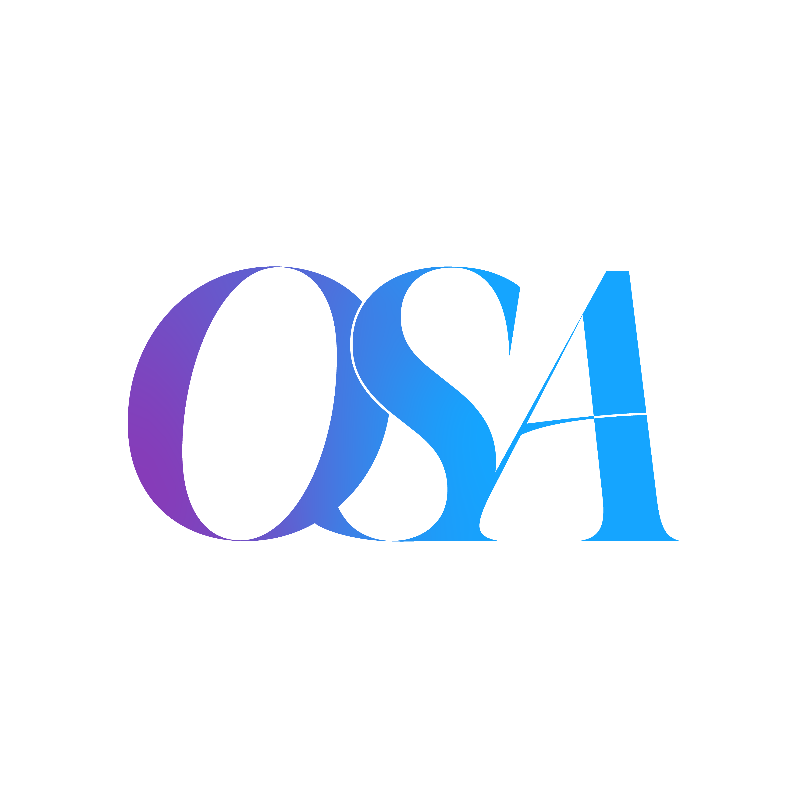
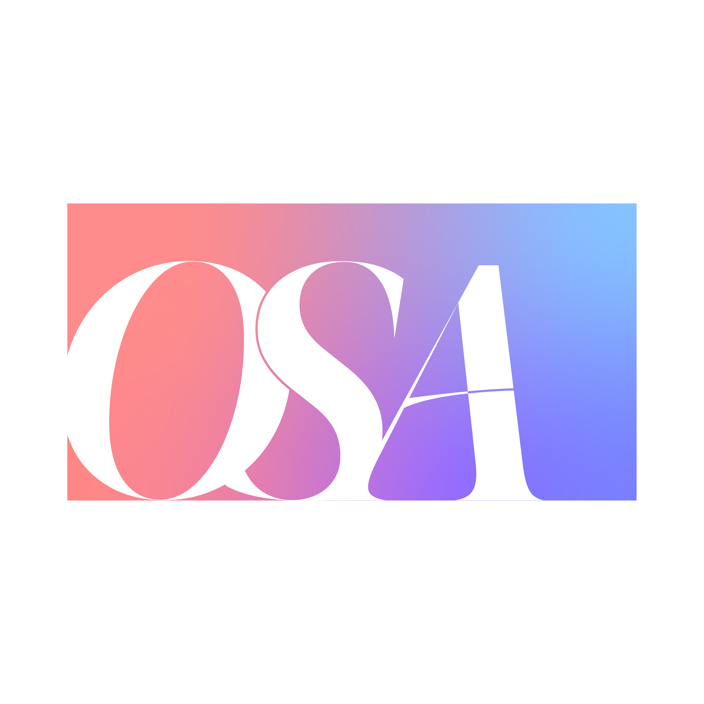
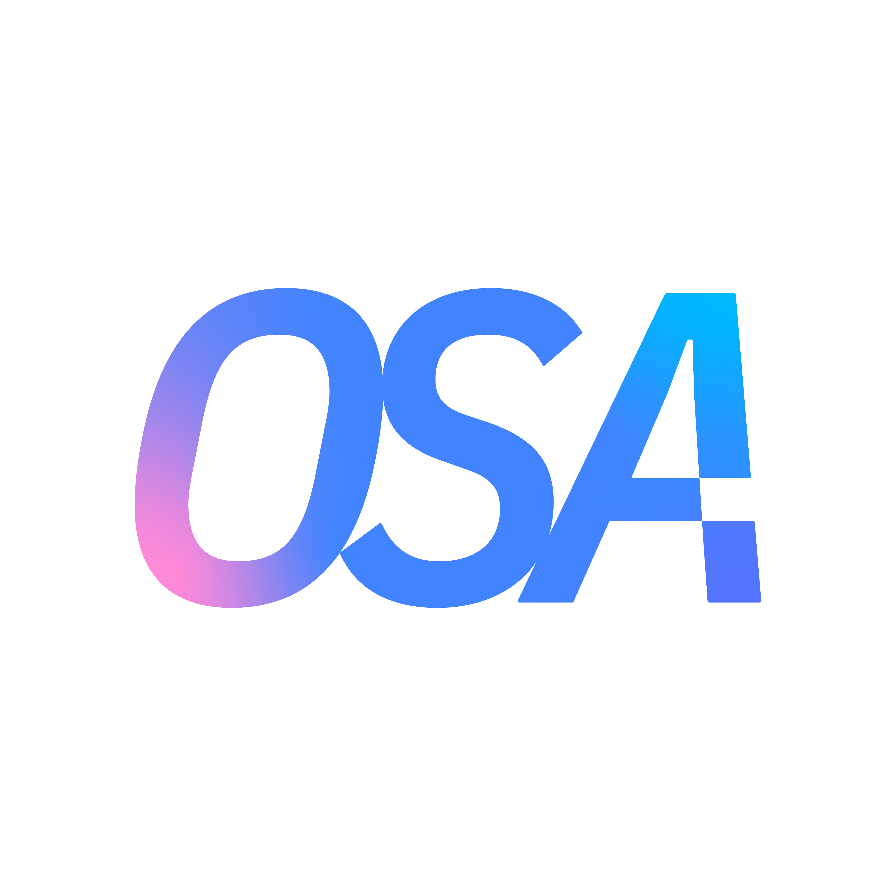
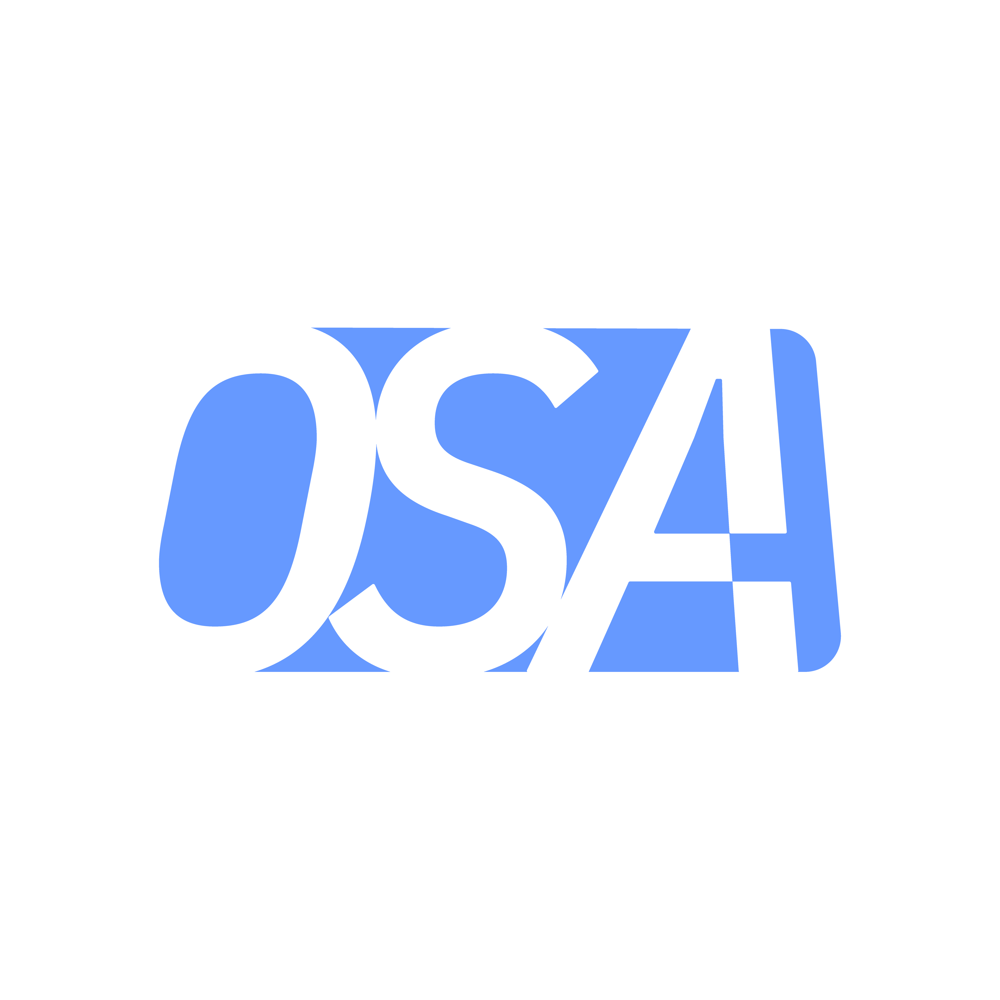
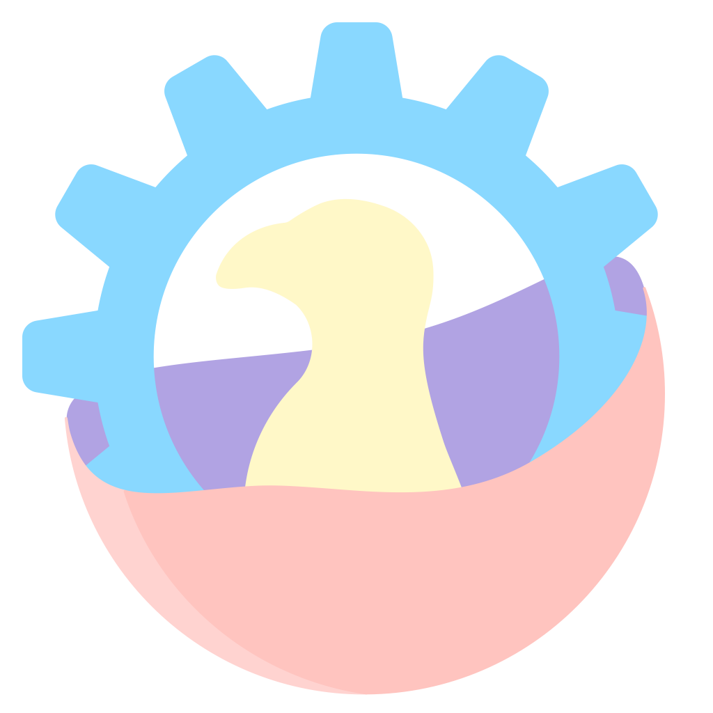
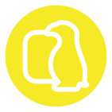

# HITSZ OSA Stickers

## Naming convention

```sh
[kebab-case-name]-shape-size.extension
```

e.g.: `[gumball-and-darwin]-square-8_9.png` means a square sticker named 'Gumball and Darwin' of 8.9 centimetres.

## Gallery

### Meta

<div>
  
  
  
</div>

### LGTM

<div> 
  
  
</div>

### Pub

<div> 
  
</div>

### Flake

<div>
  
  
  
</div>

### OSA glyphs

<div>
  
  
  
  
</div>

### Penguin orb

<div>
  
</div>

### Wiki

<div>
  
  
  
  
  
</div>

### Weekly

<div> 
  
</div>

